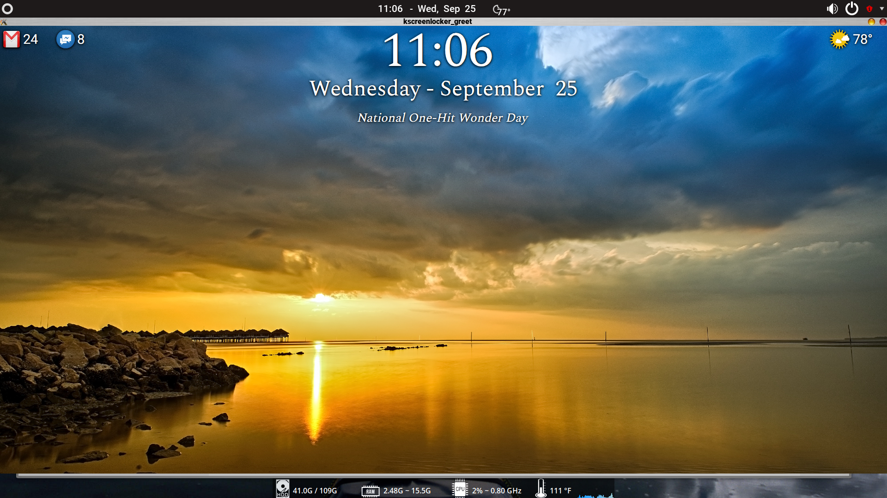

# Custom Lockscreen readme

A good hack job to get weather and calendar events on the lockscreen
Or what i learned using linux for 2 years.

## How it works:
kscreenlocker does not allow internet acesss, so this is a workaround using local files as js variables
Modified Breeze plasma qml files to get the desired effects. Designed for 1920x1080 screens.
I am not a QML/QT expert, maybe someone with better skills could do this more efficently.

Requirements:
KDE Plasma 5.15, Node JS server, systemd
* uses node js functions for both calendar and temperature functions
* uses node fs to create js variable files used in qml lockscreen files
* calendar events from public ical National Day, but could use any web access public calendar
** edit nat-day1.js to change url for calendar of your choice
* using node js functions and systemd to run the scripts at certain times to keep lockscreen current

## Installation at your own risk ;)  Backup original files so u can revert back if dont like or does not work

* Extract all files to home directory / lockscreen
* Install node js server within that folder
* Install node ical, fs, weather
    ** weather function from https://github.com/nahidulhasan/nodejs-weather-app - modified to write to file instead of console
    ** modify ical js to your own public event calendar
    ** modify weather script for your city - 
        within the nodejs-weather-app-master folder edit index.js and change city name   
             const city = location || 'City Name, State USA';
        ** running within folder node weather will retrieve current temp for your city and create
        temp.js used as variable within Lockscreen.qml

### Plasma changes
_____________
Use Plasma Look And Feel Explorer installed as plasma-sdk to create a new Look and Feel Theme within 
/home/.local/share/plasma/look-and-feel/"Your Theme'
This is required as Breeze LnF theme has all the components needed to customize the Lockscreen.
Copy the folders from Breeze > /usr/share/plasma/look-and-feel/org.kde.breeze.desktop/contents/
to your new theme folder created above.

Use the qml files supplied to over-ride the default plasma ones // backup originals first
* edit both Clock.qml and LockscreenUi.qml and change import statements for JS to path of download or home directory
* copy Clock.qml to /home/.local/share/plasma/look-and-feel/"Your Theme'/components/
* copy LockScreenUi.qml to /home/.local/share/plasma/look-and-feel/"Your Theme'/contents/lockscreen/
* copy MainBlock.qml  /home/.local/share/plasma/look-and-feel/"Your Theme'/contents/lockscreen/
* copy UserDelegate.qml /home/.local/share/plasma/look-and-feel/"Your Theme'/contents/components/
* copy WallpaperFader.qml  /home/.local/share/plasma/look-and-feel/"Your Theme'/contents/components/

### Systemd changes
_________
* Edit systemd service files to reflect location of node js scripts
* copy natday.service to /etc/systemd/system/       --used to fetch calendar events daily at 12:10 am
* copy natday.timer to /etc/systemd/system/         --used to fetch calendar events daily at 12:10 am
* run sudo sudo systemctl start natday.service      --starts systemd service and timer
* run sudo sudo systemctl enable natday.service     --enables systemd service and timer
* run sudo sudo systemctl enable natday.timer
* copy temp.service to /etc/systemd/system/        --used to fetch weather temperature daily every 30 mins
* copy temp.timer to /etc/systemd/system/          --used to fetch weather temperature daily every 30 mins
* run sudo sudo systemctl start temp.service       --starts systemd service and timer
* run sudo sudo systemctl enable temp.service      --enables systemd service and timer
* run sudo sudo systemctl enable temp.timer

### Testing
___________

1. Test ical event info with > node js ical with node natday1.js  will retrieve calendar event and create natday.js variable file used in Clock.qml
2. Test weather info with > node weather will retrieve temperature info and create temp.js variable file used in LockScreenUi.qml
3. Test Lockscreen with /usr/lib/kscreenlocker_greet --testing --theme /home/.local/share/plasma/look-and-feel/"Your Theme'
4. Verify SYSTEMD settings in System Settings  > SYSTEMD > TIMERS  - should be a description of the two timers installed above.

### NOTES:
____________
* node js server required for js scripts
* ical, fs, weather-app install required to work
* using node js functions and systemd to run the scripts at certain times to keep lockscreen current
* weather function from https://github.com/nahidulhasan/nodejs-weather-app - modified to write to file instead of console
* natday.js is used in Clock.qml as js variable to print the National Day calendar events - 
    this file is updated from the   systemd service/timer events
* natday1.js is used as node js to get the calendar event info
* temp.js is used in LockscreeUi.qml as variable to print the current temperature  - 
    this file is updated from the systemd service/timer events
* node weather is used to get current weather temp info  - edit weather - index.js for city info and 
   location to create variable file
* you must edit the qml files to reflect the location of these files, also the node js files must be changed 
    to reflect the location to write the js variable files

### TODO:
_________
* update temp variable to update dynamically, current only display temp from before screen locked
* get email count - requires oauth for gmail security
