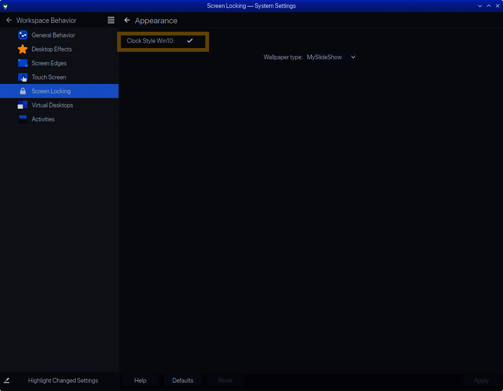

# Custom Plasma Lockscreen
## Modifications
* Display unread gmail messages count, current weather conditions and forecast, stock market index's
* Calendar events - birthdays/holidays
* Using qml animation timers to show current weather conditions, forecast, and stock market index's
* kb/mouse movement, hide clock and status info, show login/password Ui  
Click image for a short video demo

### How it works:
For security reasons, kscreenlocker does not allow internet acesss, 
Modified Breeze plasma qml files to get the desired effects. Designed for 1920x1080 screens.  

** New integrated both into one with config settings 
<picture>
  
</picture>  

## Requirements:
* Some knowledge of linux, node javascript,python,plasma qml files
* KDE Plasma 5.15, Linux 4.x kernel python3  
* [Python](https://www.python.org/download/releases/3.0/)  
* [Python script for gmail](https://github.com/akora/gmail-message-counter-python)
* [Gmail Oauth](https://developers.google.com/gmail/api/quickstart/python)
* [Plasma Look And Feel Explorer installed as plasma-sdk from your distro repo](
      https://userbase.kde.org/Plasma/Create_a_Look_and_Feel_Package)

### Installation process. Backup original files so u can revert back.

* Extract MyBreeze.zip to $HOME/.local/share/plasma/look-and-feel/  
   ** Custom Breeze theme for testing the qml  
* Change global theme to new MyBreeze theme  
  ** test lockscreen with  
      /usr/lib/kscreenlocker_greet --testing --theme $HOME/.local/share/plasma/look-and-feel/MyBreeze    
 * Read [install.md](install.md) for detailed installation steps

